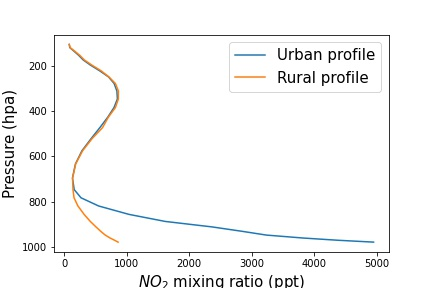

# Efficient Prediction of NO2 Vertical Profiles Using ML

Welcome to my 8-month research project at a UC Berkeley [atmospheric chemistry lab](https://cohen.cchem.berkeley.edu/) under the guidance of Dr. Ron Cohen! 

## Introduction

In order to get an accurate retrieval of NO2 data from a satellite, scientists require a priori knowledge about where NO2 generally exists in the atmosphere. This a prior knowledge comes in the form of a vertical profile (see picture below for both urban and rural NO2 vertical profiles over Atlanta, GA). Traditionally, simulation of vertical profiles is done by a chemstry transport model (CTM), like NOAA's [Weather Research and Forecasting (WRF) model coupled with Chemistry](https://ruc.noaa.gov/wrf/wrf-chem/) (WRF-CHEM). However, simulations using a CTM take a long time and pose a potential problem for future generations of geostationary satellite instruments that make observations at a higher resolution. This project is a proof of concept that machine learning can be used to simulate a priori NO2 vertical profiles at both high spatial and high temporal resolution. Since the chemical simulation component of a CTM is the source of the bottleneck, our model uses exclusively as inputs meteorology and emissions data to predict where NO2 is presecnt in the atmosphere over a given region. Our urban and rural model yields over Atlanta, GA yields good results and we plan to scale the model up to include the Continental United States.
 

  
   
  <em>Where NO2 generally lies in the atmosphere for both urban and rural domains in Atlanta, GA</em>

## Repo Breakdown

- Code: 

- Presentations:

- Data: This directory contains one file - my final, clean data frame used for exploratory data analysis.

## Data Source

## Video

## Acknowledgement

